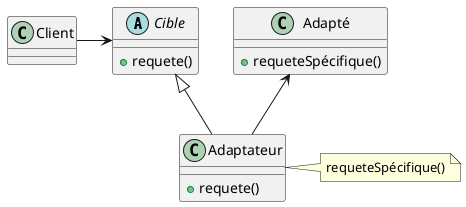
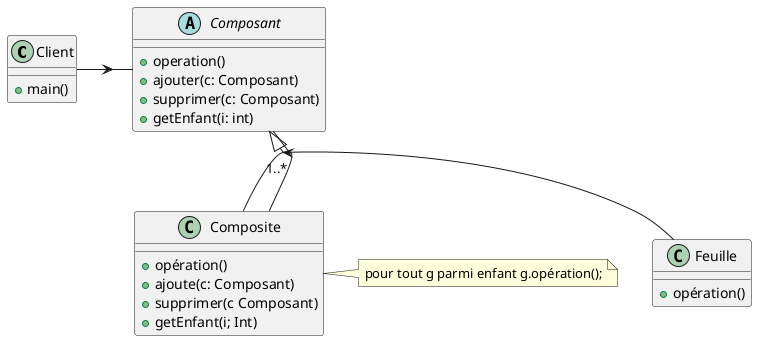
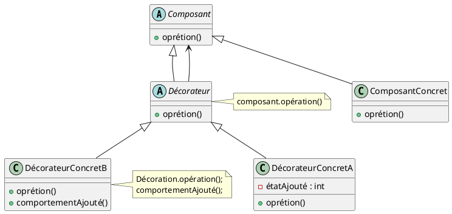
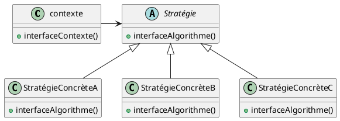
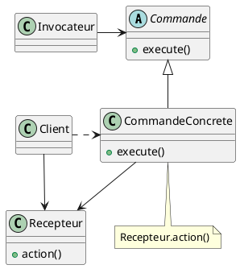
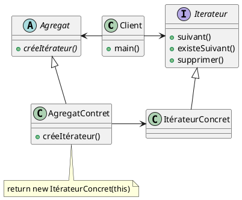
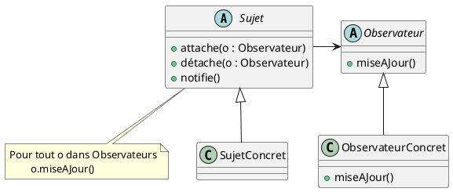
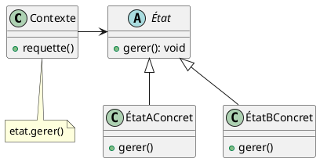
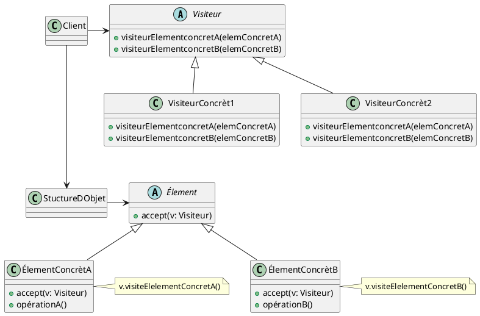

Les inconvénients des patterns :

- Ils occasionnent plus de classes
- Ils peuvent être peu adaptés dans des environnements dit “limités”
(comme Android)
- c’est à encapsuler ce qui varie.
- Ce principe nous enseigne à limiter chaque classe à une seule
responsabilité. (Cohésion)
- Nous savons que nous devons éviter comme la peste de changer quelque
chose à une classe(Couplage)

## Creational patterns

Les patterns de création, relatifs à la création d’objet

- **Singleton** : une seule instance d’une classe
- **Prototype** : clone, héritage de prototype
- **Builder**: construire un objet avec plusieurs éléments choisi (
recette de cuisine)
permet de construire un objet complexe étape par étape.
Le constructeur est appelé à chaque étape de la construction de l'objet.
Le client n'a pas besoin de connaître les étapes de construction de
l'objet, il suffit de lui fournir un objet de construction. Le pattern
Builder est utilisé pour construire des objets complexes étape par étape.
Il permet de séparer la construction d'un objet complexe de sa
représentation finale, de sorte que le même processus de construction
puisse créer différentes représentations.
- **Factory** : fabrique des objets en fonction d’un paramètre
- **Abstract factory** : fabrique des objets en fonction d’un paramètre,
mais avec plusieurs usines

## Structural patterns

Les patterns structuraux, qui structurent l’organisation des classes entre
elles, comment elles sont liées

- **Adapter** : adapte une interface à une autre, On utilisera le pattern Adaptateur lorsque :
  - On veut utiliser une classe existante, mais dont l’interface ne coïncide pas avec celle
escompté.
  - On souhaite créer une classe réutilisable qui collabore avec des classes sans relations
avec elle et encore inconnues, c’est-à-dire avec des classes qui n’auront pas
nécessairement des interfaces compatibles.
  - On a besoin d’utiliser plusieurs sous-classes existantes, mais l’adaptation de leur
interface par dérivation de chacune d’entre elles est impraticable. Un adaptateur
peut adapter l’interface de sa classe parente.

- **Composite** : un objet contient d’autres objets
Composite est un patron de conception structurelle qui permet d’agencer les
objets dans des arborescences afin de pouvoir traiter de la même et unique
façon les objets individuels et les combinaisons de ceux-ci.

- **Decorator** : un objet contient un autre objet, et ajoute des
fonctionnalités  
*surchargeant les méthodes.*
permet d'ajouter des fonctionnalités à un objet de manière dynamique.

- **Facade** : permet de fournir une interface unifiée pour un ensemble
d'interfaces dans un sous-système.

## Behavioral patterns

Les patterns comportementaux, qui définissent la communication entre
objets

- **Strategy** : Permet de définir une famille d'algorithmes, encapsuler
chacun d'eux et les rendre interchangeables.
En général, les clients créent un objet StrategieConcrete, et le passent au contexte, par la suite les clients interagissent exclusivement avec le contexte.

- **Command** : un objet encapsule une commande, et peut l’exécuter,
encapsuler une demande sous la forme d'un objet, ce qui permet de
**paramétrer les clients avec différentes demandes.**

- **Iterator** : Permets de parcourir les éléments d’une collection sans
révéler sa représentation interne (liste, pile, arbre, etc.).
Même appel pour n'importe quel type de collection
en java on utilise l'interface Iterable et l'interface Iterator
`java.util.Iterator` et `java.lang.Iterable`

- **Observer** : permet à un objet de surveiller l'état d'un autre objet
et d'être informé lorsque cet état change.
Le design pattern Observer est utilisé pour établir une relation de type
"un-à-plusieurs" entre des objets, où un objet principal, appelé "sujet"
(ou "observable"), informe plusieurs autres objets, appelés
"observateurs", lorsqu'il subit un changement d'état. L'idée est de
définir une relation de dépendance entre ces objets sans les coupler de
manière rigide. Cela permet de mettre à jour automatiquement les
observateurs lorsque le sujet change d'état, sans avoir à les relier
explicitement.

- **Mediator** : un objet centralise la communication entre plusieurs
objets, associe un objet à un autre (centrale d'avion)
- **State** : un objet change de comportement en fonction de son état (ex:
un bouton qui change de couleur en fonction de son état)
Modélise des objets dont le comportement varie en fonction de leur état interne. L'idée
est de définir une classe abstraite représentant l'état général d'un
objet, et des sous-classes concrètes représentant les différents états
spécifiques. Chaque état peut définir ses propres comportements pour les
différentes méthodes de l'objet. L'objet principal, appelé "contexte",
maintient une référence à un objet d'état particulier, qui détermine le
comportement actuel de l'objet. En modifiant l'état du contexte, on peut
modifier le comportement de l'objet.

- **Visitor** :
